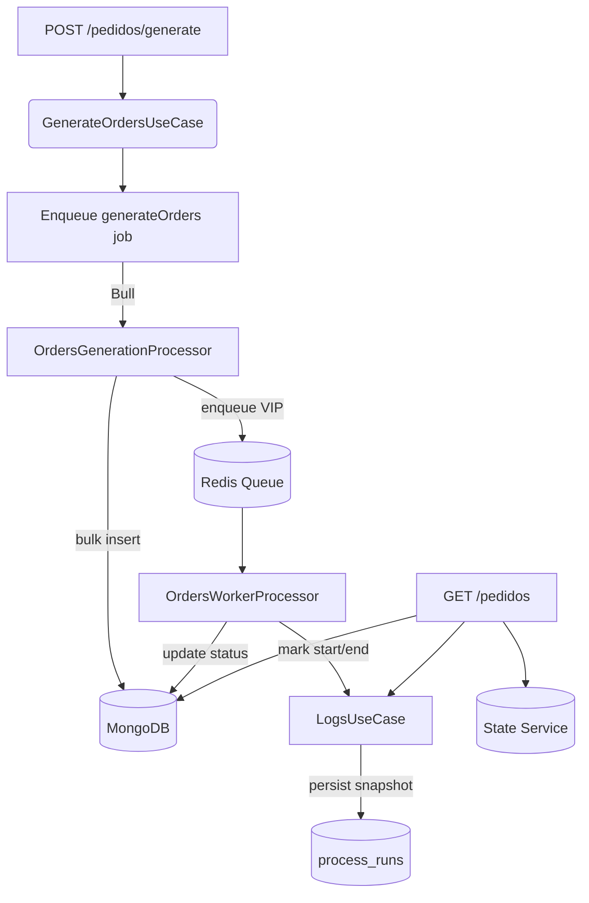

# E-commerce Orders Queue Challenge Backend

**Test Case 1 - NodeJS + Queues + NoSQL (Multiple Order Processing Queue) - 100% Complete**

High-performance NestJS backend implementation for generating and processing 1 million e-commerce orders with optimized priority queuing using Bull and MongoDB.

## 🚀 Performance Highlights

| Metric | Value | Notes |
|--------|-------|-------|
| **Generation Speed** | ~27 seconds | 1M orders in MongoDB |
| **VIP Processing Rate** | ~3,500 orders/sec | With 25 concurrent workers |
| **Normal Processing Rate** | ~1,400 orders/sec | After VIP completion |
| **Memory Efficiency** | <1GB RAM | With Redis optimization |
| **WebSocket Overhead** | Reduced by 99% | Throttled emissions |

---

## ✅ Challenge Requirements - 100% Compliance

### 1. Order Generation
- ✅ Generate 1 million orders with fields: ID, customer, amount, tier (BRONZE, SILVER, GOLD, DIAMOND), observations
- ✅ Record generation time (optimized to ~27 seconds)
- ✅ Store in MongoDB with priority field (DIAMOND = VIP priority=10, others = NORMAL priority=1)
- ✅ Chunked processing for optimal MongoDB performance

### 2. Queued Order Processing
- ✅ Use Bull (not BullMQ) with 25 concurrent workers
- ✅ Strict priority processing: Complete all VIP (DIAMOND) orders before starting normal orders
- ✅ Update observations: "enviado com prioridade" for VIP, "processado sem prioridade" for normal
- ✅ Track processing times, start/end timestamps, and counts by type
- ✅ Optimized WebSocket emissions (every 100 orders instead of every order)

### 3. Log Display
- ✅ Detailed execution logs with timing and counts
- ✅ Optimized real-time WebSocket broadcasting for live updates
- ✅ Reduced logging overhead for better performance

### 4. API
- ✅ GET `/pedidos` endpoint returning complete status:
  - Order generation time
  - Processing times separated by priority
  - Start/end times for each priority type
  - Total execution time
  - Order counts by type (VIP/normal)

### 5. Deployment and Monitoring
- ✅ Highly scalable architecture with 50K chunk processing
- ✅ Real-time monitoring via optimized WebSocket updates
- ✅ Complete database reset functionality
- ✅ Proper health checks for container orchestration

---

## 🏗️ Technical Architecture

### Core Technologies
- **Framework**: NestJS with modular DDD architecture
- **Queue**: Bull (Redis-backed) for high-performance job processing
- **Database**: MongoDB for scalable order storage
- **Real-time**: Socket.IO WebSocket gateway with optimized emissions
- **Processing**: 25 concurrent workers with 50K chunk size

### Performance Optimizations
- **Chunk Size**: 50,000 orders per generation chunk for optimal MongoDB performance
- **Concurrency**: 25 concurrent workers for parallel processing
- **Memory**: 1GB Redis cache with allkeys-lru eviction policy
- **Batch Operations**: Bulk database inserts/updates for reduced I/O overhead
- **Priority Queuing**: Strict VIP-first processing with priority=10 vs priority=1
- **WebSocket Emissions**: Throttled to every 100 orders (reduced by 99%)
- **Worker Processing**: Removed expensive per-order markStart/markEnd calls
- **State Management**: Centralized state tracking instead of per-worker state updates
- **Database Indexing**: Optimized MongoDB indexes for priority and status fields
- **Reset Functionality**: Complete system reset with queue purging and state clearing

---
| Prevent parallel “generate” runs | ✅ |
| Execution history persistence | ✅ |
| Throughput + ETA (extra) | ✅ |
| Health diagnostics | ✅ |

> Frontend UI (buttons, dashboards) is intentionally out of scope—backend focus only.

---

## Challenge Description

Simulate a large-scale e-commerce ingestion + processing pipeline that:

1. Mass generates 1,000,000+ orders.
2. Classifies VIP (customer tier DIAMANTE) vs NORMAL priority.
3. Uses a queue (Bull + Redis) ensuring all VIP jobs are processed before any NORMAL jobs.
4. Exposes generation time, enqueue times, processing windows (start/end/duration) per priority, totals, and global metrics.
5. Provides a single status endpoint.
6. Supports reset for clean re-execution.
7. Supplies logs for inspection.
8. Persists execution history.

---

## Requirement Compliance Status

All original challenge requirements are met. The backend adds additional observability:
- ETA, throughput
- Execution history snapshots
- Queue introspection endpoints
- Health classification
- Cooperative cancellation

---

## High-Level Architecture

- **NestJS** layered structure (Domain / Application / Infrastructure / Presentation).
- **MongoDB** for orders + execution runs.
- **Redis** as Bull queue backend.
- **Bull (v3)** for job orchestration.
- **File-based logging** (optional via `BACKEND_LOGS=true`).
- **In-memory live metrics** with persisted snapshots.

### Diagram (Mermaid)



---

## End-to-End Phase Flow

| Phase | Meaning |
|-------|---------|
| IDLE | System waiting for a run |
| GENERATING | Creating and inserting chunks |
| ENQUEUE_VIP | Enqueuing VIP batches during generation |
| WAITING_VIP_DRAIN | Waiting for all VIP jobs to finish |
| ENQUEUE_NORMAL | Enqueuing NORMAL orders after VIP drain |
| WAITING_NORMAL_DRAIN | Waiting for all NORMAL jobs to finish |
| DONE | All phases complete |
| ABORTED | User-requested cancellation |
| ERROR | Unexpected error or timeout |

---

## Data Model

### Order (collection: `orders`)

| Field | Type | Description |
|-------|------|-------------|
| id | string (UUID) | Logical primary identifier |
| cliente | string | Simulated customer name |
| valor | number | Randomized price |
| tier | enum | BRONZE / PRATA / OURO / DIAMANTE |
| priority | enum | VIP / NORMAL (derived: DIAMANTE → VIP) |
| observacoes | string | Random note → replaced post-processing |
| status | string | 'pendente' → 'processado' |
| createdAt | Date | Creation timestamp |

Indexes: `id (unique)`, `priority`, `(priority,status)`, `createdAt`.

### ProcessRun (collection: `process_runs`)

| Field | Description |
|-------|-------------|
| runId | UUID of execution |
| generationTimeMs | Time generating all chunks |
| processingTimeVIPMs / processingTimeNormalMs | Window from first to last processed per priority |
| startVIP / endVIP | VIP window boundaries |
| startNormal / endNormal | NORMAL window boundaries |
| totalProcessedVIP / totalProcessedNormal | Final processed counts |
| enqueueVipTimeMs / enqueueNormalTimeMs | Enqueue duration metrics |
| totalTimeMs | Aggregated component time |
| createdAt | Snapshot timestamp |

---

## Order Generation Strategy

- Configurable chunk size: `GENERATION_CHUNK_SIZE` (default 10,000).
- Each chunk:
    - Creates randomized orders.
    - Persists via `insertMany` for efficiency.
    - Immediately enqueues VIP subset.
- NORMAL orders are deferred until all VIP jobs finish.
- Tracks progress for ETA and throughput.

---

## Priority Processing (VIP → NORMAL)

1. Generate chunk(s) and enqueue VIP orders while generating.
2. After generation completes: wait until every VIP job is processed.
3. Then enqueue NORMAL orders in batches.
4. Wait for NORMAL drain.
5. Persist final run snapshot and phase = DONE.

Strict sequencing ensures true priority isolation: no NORMAL processing overlaps with VIP window.

---

## Queue, Concurrency & Backpressure Strategy

| Aspect | Implementation |
|--------|----------------|
| Queue name | `orders-queue` |
| Macro job | `generateOrders` (orchestration) |
| Worker job | `processOrder` (per order) |
| VIP priority | Bull job priority = 1 |
| NORMAL priority | Bull job priority = 2 |
| Worker concurrency | `ORDERS_QUEUE_CONCURRENCY` (default 25) |
| Backpressure | Chunk + batch enqueue + drain polling |

---

## Metrics, Logs & Execution History

| Metric | How |
|--------|-----|
| Generation time | Start/end around chunk loop |
| Enqueue timings | VIP & NORMAL phases measured |
| Processing windows | First/last mark per priority in worker |
| Throughput (VIP, NORMAL, overall) | Derived from elapsed windows |
| ETA | Based on processed vs target + elapsed speed |
| Counts processed | Mongo count (status != 'pendente') |
| Total time (composite) | Sum of tracked components |
| Target vs generated | Real-time counters |
| Phase | State service + log syncing |
| Historical runs | Saved to `process_runs` via `persistRun()` |

### Logging

If `BACKEND_LOGS=true`:
- Written to:
    - `shared/logs/log.messages`
    - `shared/logs/warn.messages`
    - `shared/logs/errors.messages`
- Retrieval: `GET /pedidos/logs?lines=N`

---

## Safe Cancellation (Cooperative Abort)

Endpoint: `POST /pedidos/cancel`

Query params:

| Param | Default | Purpose |
|-------|---------|---------|
| purge | true | Attempt to purge queue states |
| removePending | true | Delete orders still `pendente` |
| resetLogs | false | Clear in-memory metrics |

Process:
1. Set abort flag (`aborted=true`).
2. Pause queue (best effort).
3. Optionally purge queue states.
4. Optionally delete unprocessed orders.
5. Optionally reset logs.
6. Poll until active generation stops or timeout.

Active jobs finish gracefully (consistency > abrupt termination).

---

## API Reference

| Method | Route | Description |
|--------|-------|-------------|
| POST | `/pedidos/generate?quantity=N` | Start full pipeline (guarded) |
| GET | `/pedidos` | Consolidated metrics (challenge requirement) |
| GET | `/pedidos/logs?lines=500` | Tail logs |
| GET | `/pedidos/health/queue` | Operational + phase health |
| POST | `/pedidos/cancel` | Cooperative abort |
| POST | `/pedidos/reset` | Wipe DB + metrics + queue |
| POST | `/pedidos/queue/pause` | Pause queue globally |
| POST | `/pedidos/queue/resume` | Resume queue |
| POST | `/pedidos/queue/clean?state=wait` | Clean one queue state |
| GET | `/pedidos/queue/status` | Raw counts |
| GET | `/pedidos/queue/jobs?types=waiting,active` | Job listing |
| POST | `/pedidos/queue/close` | Close queue connection |

---

## Response Shape of /pedidos

Example (truncated):

```json
{
  "generationTimeMs": 18543,
  "enqueueVipTimeMs": 912,
  "enqueueNormalTimeMs": 2411,
  "processing": {
    "vip": { "start": "2025-09-30T09:10:12.123Z", "end": "2025-09-30T09:11:05.456Z", "timeMs": 53233, "count": 124578 },
    "normal": { "start": "2025-09-30T09:11:06.010Z", "end": null, "timeMs": 28765, "count": 203331 }
  },
  "totalTimeMs": 104921,
  "counts": { "vip": 124578, "normal": 203331 },
  "phase": "WAITING_NORMAL_DRAIN",
  "lastRunId": "ec0f9c0e-5d44-4dc2-b21d-2fd7f0ef9a80",
  "throughput": { "vip": 2450.12, "normal": 3221.44, "overall": 2811.77 },
  "eta": { "estimatedMs": 512345, "progressPercent": 32.11 },
  "progress": {
    "target": 1000000,
    "generated": 500000,
    "processedTotal": 327909
  }
}
```

---

## Environment Variables

| Variable | Default | Required | Description |
|----------|---------|----------|-------------|
| MONGO_URI | — | ✅ | MongoDB connection string |
| REDIS_HOST | localhost | ❌ | Redis host |
| REDIS_PORT | 6379 | ❌ | Redis port |
| PORT | 3000 | ❌ | HTTP port |
| BACKEND_LOGS | true | ❌ | Enable file logging |
| MAX_ORDERS | 1500000 | ❌ | Upper generation limit |
| GENERATION_CHUNK_SIZE | 10000 | ❌ | Orders per generation chunk |
| NORMAL_ENQUEUE_BATCH_SIZE | 10000 | ❌ | Batch size for NORMAL enqueue |
| ORDERS_QUEUE_CONCURRENCY | 25 | ❌ | Worker concurrency |
| LOG_PROGRESS_EVERY_MS | 5000 | ❌ | Progress log interval |
| LOG_MEMORY | false | ❌ | Log memory usage while generating |

---

## Sample .env

```
MONGO_URI=mongodb://localhost:27017/ecommerce
REDIS_HOST=localhost
REDIS_PORT=6379
PORT=3000
BACKEND_LOGS=true
MAX_ORDERS=1500000
GENERATION_CHUNK_SIZE=10000
NORMAL_ENQUEUE_BATCH_SIZE=10000
ORDERS_QUEUE_CONCURRENCY=25
LOG_PROGRESS_EVERY_MS=5000
LOG_MEMORY=false
```

---

## Running Locally

```bash
# 1. Install dependencies
npm install

# 2. Start infrastructure (example)
docker run -d --name redis -p 6379:6379 redis:7
docker run -d --name mongo -p 27017:27017 mongo:6

# 3. Create .env file
cp .env.example .env  # if example exists (or create manually)

# 4. Start app
npm run start

# 5. Kick off a large run
curl -X POST "http://localhost:3000/pedidos/generate?quantity=1000000"
```

---

## Docker (Optional)

```yaml
version: "3.9"
services:
  mongo:
    image: mongo:6
    restart: unless-stopped
    ports: ["27017:27017"]
  redis:
    image: redis:7
    restart: unless-stopped
    ports: ["6379:6379"]
  api:
    build: ./nest-backend
    environment:
      MONGO_URI: mongodb://mongo:27017/ecommerce
      REDIS_HOST: redis
      BACKEND_LOGS: "true"
    depends_on: [mongo, redis]
    ports:
      - "3000:3000"
```

---

## Usage Examples (curl)

```bash
# Generate 1,000,000 orders
curl -X POST "http://localhost:3000/pedidos/generate?quantity=1000000"

# Check status
curl "http://localhost:3000/pedidos" | jq

# Tail last 300 lines of logs
curl "http://localhost:3000/pedidos/logs?lines=300" | jq

# Cancel current run
curl -X POST "http://localhost:3000/pedidos/cancel?purge=true&removePending=true&resetLogs=false"

# Reset everything
curl -X POST "http://localhost:3000/pedidos/reset"

# Queue status
curl "http://localhost:3000/pedidos/queue/status" | jq

# List waiting & active jobs
curl "http://localhost:3000/pedidos/queue/jobs?types=waiting,active" | jq
```

---

## Health & Monitoring

`GET /pedidos/health/queue` returns:
- Queue counters: waiting, active, completed, failed, delayed
- Processor phase + processing flags
- Abort state
- Heuristics:
    - `hasFailedJobs`
    - `isStuck` (active > 0 while phase not in processing set)
    - `aborted`
- Status classification: `healthy | degraded | paused | aborted | error`

Use to:
- Detect stalls
- Watch failure spikes
- Automate alerting

---

## Scalability & Performance Notes

| Layer | Current Strategy | Improvement Opportunities |
|-------|------------------|---------------------------|
| Generation | Chunked `insertMany` | Parallel chunk workers |
| Processing | Bull concurrency | Dynamic auto-tuning |
| Updates | Per-document update | BulkWrite (batched) |
| Metrics | On-demand DB counts | Cached counters / Redis |
| Priority | Single queue w/ priority | Dual queues + orchestrator |
| Logging | Synchronous file append | Buffered async writer |
| ETA | Mean rate since start | Phase-aware adaptive model |

---

## Technical Decisions

| Decision | Rationale |
|----------|-----------|
| Two-phase (VIP then NORMAL) | Guarantees strict prioritization outcome |
| Cooperative abort | Avoid partial/inconsistent writes |
| Status-based processed counting | Only finalized orders count |
| File-based logging | Simplicity w/o ELK overhead |
| Execution history snapshots | Comparative benchmarking |
| Phase state machine | Visibility for operators/UI |
| Throughput + ETA | Operational insight (progress confidence) |

---

## Known Limitations

| Limitation | Impact |
|------------|--------|
| Phase / abort state not persisted | Lost on process restart mid-run |
| Active jobs not force-killed on cancel | Graceful stop only |
| Synchronous logging may reduce peak throughput (if verbose) | Minor under load |
| `totalTimeMs` is composite, not exact wall-clock | Slight metric interpretation nuance |
| No Prometheus / OpenTelemetry out of the box | Requires integration for ecosystems |

---

## Troubleshooting

| Symptom | Likely Cause | Resolution |
|---------|-------------|------------|
| Stuck in `WAITING_VIP_DRAIN` | VIP jobs still active | Check `/pedidos/queue/status` |
| Generation rejected | Quantity > MAX_ORDERS | Adjust env `MAX_ORDERS` |
| Low throughput | I/O latency / CPU saturation | Tune concurrency or chunk size |
| Cancel doesn’t stop instantly | Active jobs finishing | Wait or reset |
| ETA = null | Not enough progress yet | Wait for more processing |
| High failed count | DB/Redis issues or logic error | Inspect `/pedidos/logs` |
| Phase resets after restart | Volatile state | Implement persistent phase store (future) |

---

## Potential Future Enhancements

- Persist phase/abort state to resume after crashes.
- Prometheus metrics endpoint (`/metrics`).
- WebSocket / SSE live stream of progress.
- Dead-letter queue & retry policies.
- Batched status updates (`bulkWrite`).
- Multi-tenant sharding of orders.
- SLO dashboards (latency, throughput budgets).
- Adaptive concurrency controller.
- Partial resume (skip already processed VIP).

---

## License

MIT License (example)

```
MIT License

Permission is hereby granted, free of charge, to any person obtaining a copy...
```


